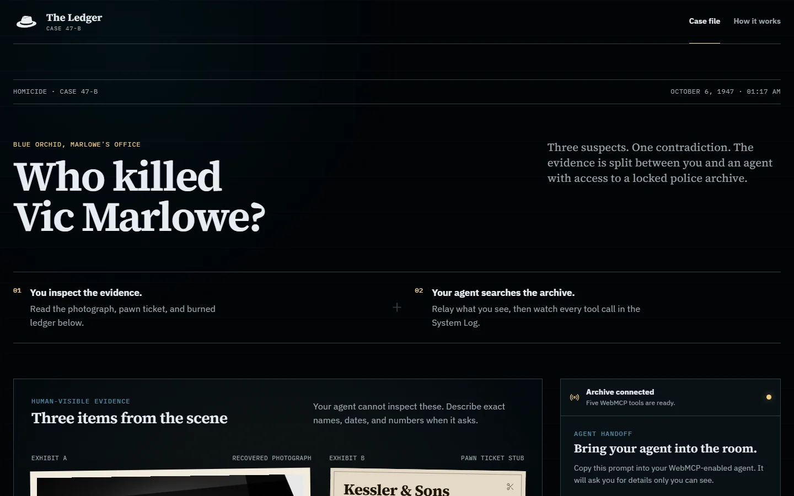
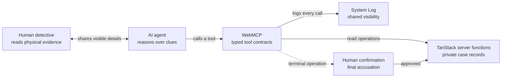

<div align="center">
  <picture>
    <source media="(prefers-color-scheme: dark)" srcset="../public/readme/hat-white.png">
    <source media="(prefers-color-scheme: light)" srcset="../public/brand/hat.png">
    
  </picture>

  <h1>The Ledger</h1>

  <p><strong>A WebMCP noir mystery for one human detective and one AI agent.</strong></p>
  <p>
    Inspect the evidence. Relay what you see. Watch the agent search a locked police archive.<br>
    Neither investigator has enough information to close the case alone.
  </p>

  <p>
    <a href="https://ledger-1947.vercel.app"><strong>Open the live case</strong></a>
    &nbsp;·&nbsp;
    <a href="https://ledger-1947.vercel.app/how-it-works">Read how it works</a>
  </p>
</div>

<br>

<a href="https://ledger-1947.vercel.app">
  
</a>

> **CASE 47-B · BLUE ORCHID · OCTOBER 6, 1947**  
> Nightclub owner Vic Marlowe is dead. Three suspects remain. One contradiction closes the case.

## The premise, in 30 seconds

The Ledger divides one investigation across two kinds of access:

| Human detective | WebMCP agent |
| --- | --- |
| Reads a torn photograph, pawn ticket, and burned ledger | Calls typed tools against a private police archive |
| Sees names, dates, and damaged numbers the agent cannot inspect | Finds records, ownership links, subscribers, and alibis the human cannot query |
| Approves or declines the final accusation | Builds a supported case from evidence keys |

A shared **System Log** records every tool name, argument set, result, and evidence key. The collaboration stays visible instead of disappearing into an opaque agent session.

## Open the case

1. Visit **[ledger-1947.vercel.app](https://ledger-1947.vercel.app)** in a WebMCP-capable browser.
2. Inspect all three physical evidence items before asking the agent to investigate.
3. Copy the prepared agent prompt from the right-hand console.
4. Answer the agent with exact details from the evidence.
5. Follow each archive call in the System Log, then approve or decline the final accusation.

The evidence remains readable without WebMCP, but the connected investigation requires a browser and agent that expose the WebMCP interface.

## Five tools, one evidence chain

| Tool | Input | Purpose | Mode |
| --- | --- | --- | --- |
| `search_club_records` | Club name and date | Search reservation and visitor records | Read only |
| `lookup_pawn_ticket` | Complete ticket number | Retrieve a pawnshop transaction | Read only |
| `decode_exchange_number` | Vintage exchange notation | Resolve a telephone subscriber | Read only |
| `query_suspect_alibi` | Full suspect name | Compare a statement with the timeline | Read only |
| `accuse_suspect` | Suspect and evidence keys | Submit the supported conclusion | Human confirmation |

Each tool has a narrow JSON schema. The agent receives structured results rather than scraping the interface or guessing at controls.

## How the investigation moves



## Evidence integrity

The mystery is designed so that viewing the client bundle does not reveal the answer.

- **Server-only case data:** archive records and solution validation stay in `src/server/case-data.server.ts`.
- **Validated boundaries:** every TanStack server function validates input with Zod.
- **Declared intent:** the first four tools use `readOnlyHint`; the terminal tool is explicitly mutating.
- **Human in the loop:** `accuse_suspect` opens a native confirmation dialog before evaluation.
- **Bounded lifecycle:** an `AbortSignal` unregisters all five tools when the route unmounts.
- **Browser policy:** Vercel sends `Permissions-Policy: tools=(self)` and `Origin-Agent-Cluster: ?1`.
- **Leakage check:** the production client assets are scanned for prohibited solution strings.

## Run locally

**Requirements:** Node.js 22 or newer and npm.

```bash
git clone https://github.com/AlfinRy/ledger.git
cd ledger
npm ci
npm run dev
```

Open [http://localhost:3000](http://localhost:3000). No API key, database, or LLM request is required. The case logic is deterministic.

## Quality gate

Run the complete verification suite with:

```bash
npm run check
```

| Check | Coverage |
| --- | --- |
| `npm run typecheck` | TypeScript project validation |
| `npm test` | 6 Vitest tests for archive logic and accusation rules |
| `npm run build` | Production client and server bundles |
| `npm run verify:client` | Client-bundle solution leakage scan |
| `npm run test:e2e` | 12 Playwright tests across desktop and mobile Chromium, including Axe A/AA checks |

## Project map

```text
src/
├── components/           Evidence, prompt, System Log, confirmation dialog
├── hooks/                WebMCP registration and execution bridge
├── routes/               Case file and architecture brief
├── server/               Validated tools and server-only case records
├── stores/               Observable log and confirmation state
└── styles.css            Noir workspace design system

e2e/                      Playwright interaction and accessibility tests
scripts/                   Client-bundle leakage verification
public/                    Brand, favicon, manifest, and README assets
vercel.json                Deployment preset and security headers
```

## Built with

[**TanStack Start**](https://tanstack.com/start) · [**React 19**](https://react.dev) · **TypeScript** · [**Zod**](https://zod.dev) · [**Vitest**](https://vitest.dev) · [**Playwright**](https://playwright.dev) · [**Axe**](https://github.com/dequelabs/axe-core) · [**Vercel**](https://vercel.com)

<details>
<summary><strong>Maintainer documents</strong></summary>

- [Product context](./PRODUCT.md)
- [Design system](./DESIGN.md)
- [Product requirements](./PRD.md), contains case solution spoilers

</details>

<br>

<div align="center">
  <strong>Built by <a href="https://github.com/AlfinRy">Alfin Reynaldi</a> for the OpenAI WebMCP Challenge 2026.</strong>
</div>
